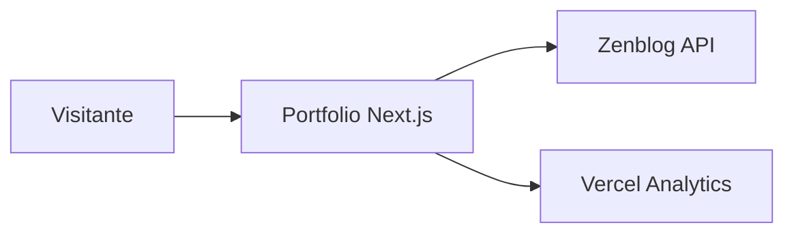
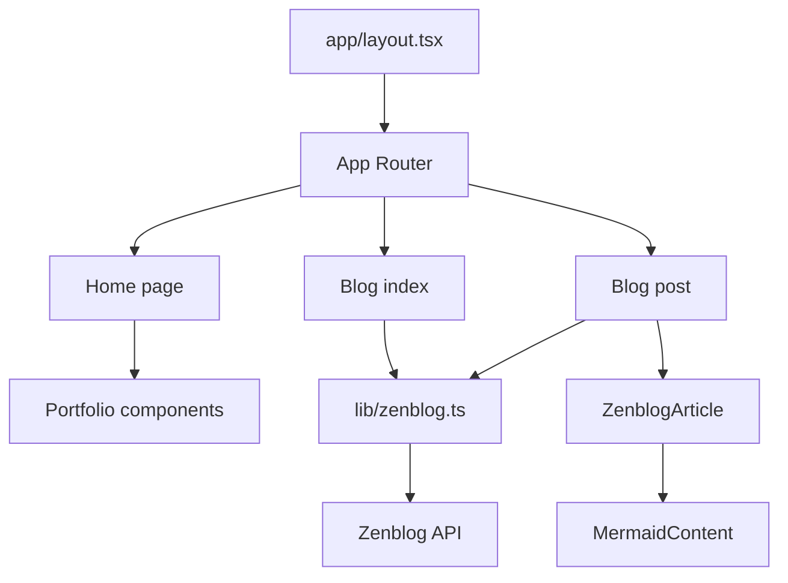
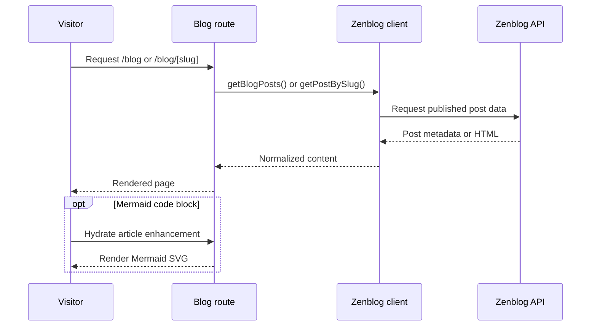

# Architecture diagrams

## Context

```mermaid
flowchart LR
  Visitor[Visitante] --> Portfolio[Portfolio Next.js]
  Portfolio --> Zenblog[Zenblog API]
  Portfolio --> Vercel[Vercel Analytics]
```

## Components

```mermaid
flowchart TD
  Layout[app/layout.tsx] --> Routes[App Router]
  Routes --> Home[Home page]
  Routes --> BlogIndex[Blog index]
  Routes --> BlogPost[Blog post]
  Home --> Sections[Portfolio components]
  BlogIndex --> ZenblogClient[lib/zenblog.ts]
  BlogPost --> ZenblogClient
  BlogPost --> Renderer[ZenblogArticle]
  Renderer --> Mermaid[MermaidContent]
  ZenblogClient --> ZenblogAPI[Zenblog API]
```

## Published blog reading sequence

```mermaid
sequenceDiagram
  participant Visitor
  participant Route as Blog route
  participant Client as Zenblog client
  participant API as Zenblog API
  Visitor->>Route: Request /blog or /blog/[slug]
  Route->>Client: getBlogPosts() or getPostBySlug()
  Client->>API: Request published post data
  API-->>Client: Post metadata or HTML
  Client-->>Route: Normalized content
  Route-->>Visitor: Rendered page
  opt Mermaid code block
    Visitor->>Route: Hydrate article enhancement
    Route-->>Visitor: Render Mermaid SVG
  end
```
