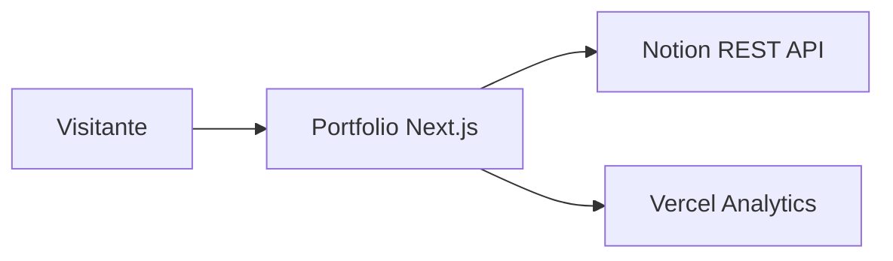
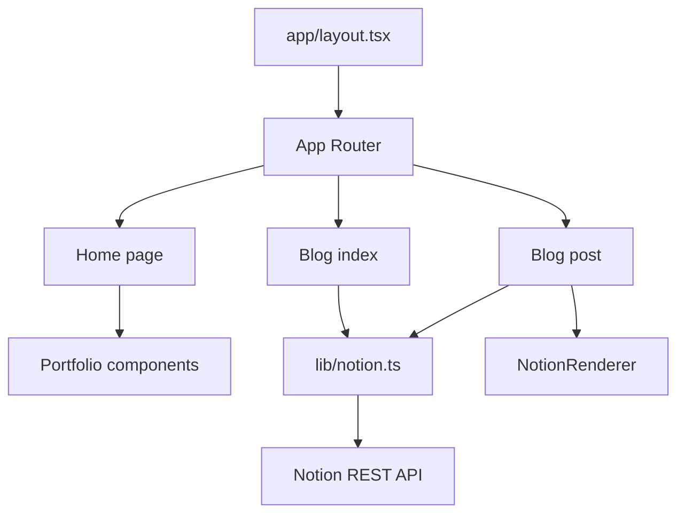
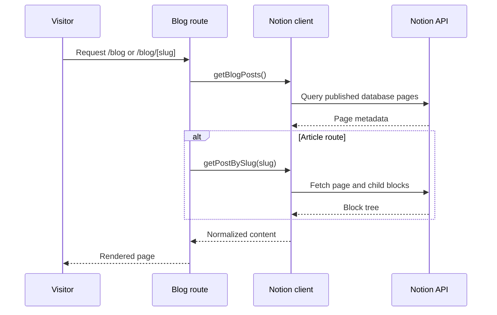

# Architecture diagrams

## Context

```mermaid
flowchart LR
  Visitor[Visitante] --> Portfolio[Portfolio Next.js]
  Portfolio --> Notion[Notion REST API]
  Portfolio --> Vercel[Vercel Analytics]
```

## Components

```mermaid
flowchart TD
  Layout[app/layout.tsx] --> Routes[App Router]
  Routes --> Home[Home page]
  Routes --> BlogIndex[Blog index]
  Routes --> BlogPost[Blog post]
  Home --> Sections[Portfolio components]
  BlogIndex --> NotionClient[lib/notion.ts]
  BlogPost --> NotionClient
  BlogPost --> Renderer[NotionRenderer]
  NotionClient --> NotionAPI[Notion REST API]
```

## Published blog reading sequence

```mermaid
sequenceDiagram
  participant Visitor
  participant Route as Blog route
  participant Client as Notion client
  participant API as Notion API
  Visitor->>Route: Request /blog or /blog/[slug]
  Route->>Client: getBlogPosts()
  Client->>API: Query published database pages
  API-->>Client: Page metadata
  alt Article route
    Route->>Client: getPostBySlug(slug)
    Client->>API: Fetch page and child blocks
    API-->>Client: Block tree
  end
  Client-->>Route: Normalized content
  Route-->>Visitor: Rendered page
```

The diagrams use the Mermaid syntax supported by the repository's `mermaid` dependency.
