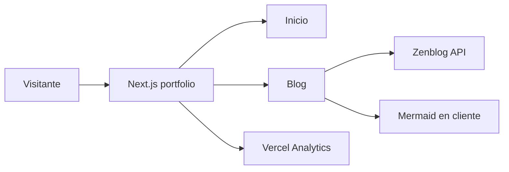

# Architecture overview — Javier Rodriguez Portfolio

## What it is

Next.js site that presents Javier Rodriguez's profile, skills, experience and contact links, and publishes technical articles from Zenblog. The home route composes the portfolio sections; `/blog` and `/blog/[slug]` provide the content experience.

## Tech stack

| Concern | Choice | Evidence |
|---|---|---|
| Language | TypeScript in strict mode | `tsconfig.json` |
| Web framework | Next.js 16, App Router, React 19 | `package.json`, `app/` |
| Styling | Tailwind CSS v4 and global CSS tokens | `package.json`, `app/globals.css` |
| Content source | Zenblog API | `lib/zenblog.ts` |
| Diagram enhancement | Mermaid | `components/mermaid-content.tsx` |
| Analytics | Vercel Analytics | `app/layout.tsx` |
| Package manager | pnpm | `pnpm-lock.yaml` |

## High-level architecture

The app is a single Next.js application. Server-rendered blog routes query Zenblog through a server-side library. The sanitized article HTML is enhanced only when a Mermaid block needs browser-side SVG rendering.

## Module map

| Module | Responsibility | Key path | Talks to |
|---|---|---|---|
| Root shell | Fonts, global styles, site metadata, skip link and analytics | `app/layout.tsx` | All routes, Vercel Analytics |
| Portfolio | Composes profile sections | `app/page.tsx`, `components/` | Navigation and static assets |
| Navigation | Main and mobile navigation | `components/navigation.tsx` | App Router client hooks |
| Blog routes | Lists posts and renders an article | `app/blog/` | `lib/zenblog.ts`, article renderer |
| Zenblog client | Fetches and normalizes posts | `lib/zenblog.ts` | Zenblog API |
| Article renderer | Sanitizes HTML and enhances Mermaid | `components/zenblog-article.tsx`, `components/mermaid-content.tsx` | Blog article route |

## Cross-cutting concerns

- **Accessibility:** the root has a skip link; global styles define visible focus and reduced-motion behavior. (source: `app/layout.tsx`)
- **Configuration:** `ZENBLOG_BLOG_ID` is read only on the server. (source: `lib/zenblog.ts`)
- **Caching:** blog pages use `revalidate = 60`. (sources: `app/blog/page.tsx`, `app/blog/[slug]/page.tsx`)
- **Errors:** the blog index renders an explanatory error state; an unavailable article becomes the framework's not-found route. (sources: `app/blog/page.tsx`, `app/blog/[slug]/page.tsx`)
