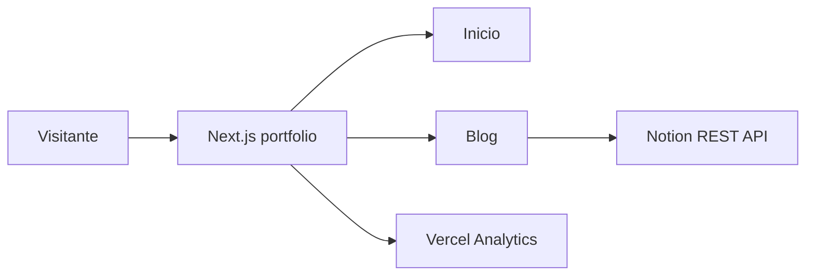

# Architecture overview — Javier Rodriguez Portfolio

## What it is

Next.js site that presents Javier Rodriguez's profile, skills, experience and contact
links, and publishes technical articles from Notion. The home route composes the
portfolio sections; `/blog` and `/blog/[slug]` provide the content experience.
(sources: `app/page.tsx`, `app/blog/page.tsx`, `app/blog/[slug]/page.tsx`)

## Tech stack

| Concern | Choice | Evidence |
|---|---|---|
| Language | TypeScript in strict mode | `tsconfig.json` |
| Web framework | Next.js 16, App Router, React 19 | `package.json`, `app/` |
| Styling | Tailwind CSS v4 and global CSS tokens | `package.json`, `app/globals.css` |
| Content source | Notion REST API | `lib/notion.ts` |
| Analytics | Vercel Analytics | `app/layout.tsx` |
| Package manager | pnpm | `pnpm-lock.yaml` |

## High-level architecture

The app is a single Next.js application. The root layout supplies shared fonts,
metadata, the skip link and analytics. Server-rendered routes compose portfolio or blog
views. The blog route calls the Notion REST API through a server-side library.
(sources: `app/layout.tsx`, `app/page.tsx`, `app/blog/page.tsx`, `lib/notion.ts`)

## Module map

| Module | Responsibility | Key path | Talks to |
|---|---|---|---|
| Root shell | Fonts, global styles, site metadata, skip link and analytics | `app/layout.tsx` | All routes, Vercel Analytics |
| Portfolio | Composes profile sections | `app/page.tsx`, `components/` | Navigation and static assets |
| Navigation | Main and mobile navigation | `components/navigation.tsx` | App Router client hooks |
| Blog routes | Lists posts and renders an article | `app/blog/` | `lib/notion.ts`, renderer |
| Notion client | Fetches and normalizes posts and block trees | `lib/notion.ts` | Notion REST API |
| Block renderer | Maps supported Notion blocks to React markup | `components/notion-renderer.tsx` | Blog article route |

## Cross-cutting concerns

- **Accessibility:** the root has a skip link; global styles define visible focus and
  reduced-motion behavior. (source: `app/layout.tsx`, `app/globals.css`)
- **Configuration:** the Notion API key and database ID are read from server environment
  variables. (source: `lib/notion.ts`)
- **Caching:** blog pages use `revalidate = 60`. (source: `app/blog/page.tsx`,
  `app/blog/[slug]/page.tsx`)
- **Errors:** the blog index renders an explanatory error state; an unavailable article
  becomes the framework's not-found route. (source: `app/blog/page.tsx`,
  `app/blog/[slug]/page.tsx`)

## Open questions / to verify

- The repository has no deployment configuration or CI workflow; confirm its Vercel
  project settings and deployment policy outside this codebase.
- `README.md` mentions React Syntax Highlighter, but it is not declared in
  `package.json` or used by the renderer.
